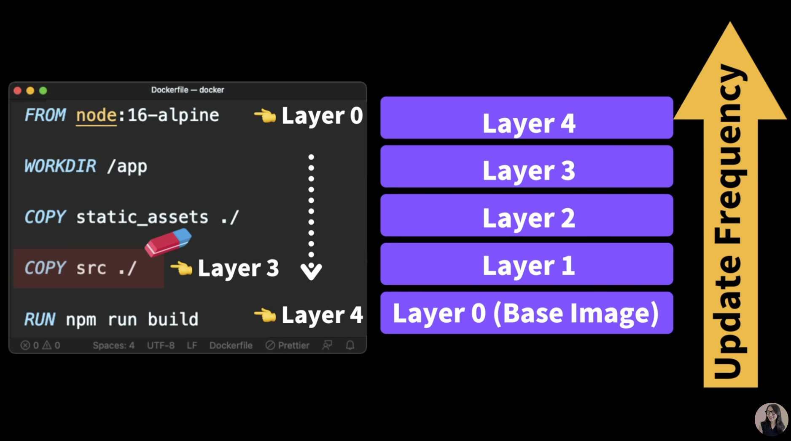

# What is Docker?

## Docker

## Dockerfile

설명서, 레시피

어플리케이션 구동 시 꼭 필요한 파일

어떤 Dependency가 필요한지

환경변수 설정

실행 스크립트 지

## Doker Image

어플리케이션을 실행하는데 필요한 코드, 런타임 환경, 시스템 툴, 시스템 라이브러리, 모든 툴&#x20;

스냅샷 해서 이미지로 만들어 둔다 라고 생각하면 됨

한번 만들어지면 불변

클래스라고 생각하면 좋음&#x20;

## Docker Container

고립된 환경에서 아까 찍은 이미지를 올려놓고 어플리케이션을 구동하게되는 것

컨테이너에서 각각 구동되는 어플리케이션은 파일도 올릴 수 있고 변경이 가능함

각각 컨테이너에서 수정된 파일이 있다면 Image에는 영향을 끼ㅈ치지 않음

생성된 instance라고 생각하면 편함

## Container Registry

생성된 이미지를 올려둘 수 있는 곳

### Public

* docker hub
* red hat
* github packages

### Private

* aws
* google cloud
* microsoft azure

&#x20;

* 일단 로컬 머신과 서버에 둘다 도커가 깔려있어야 함
* Dockerfile을 토대로 이미지를 생성해서
* 그 이미지를 Container Registry로 푸시해줌
* Server는 이미지를 Pull 해와서&#x20;
* 컨테이너에 넣어서 어플리케이션을 구동할 수 있게 됨

*
